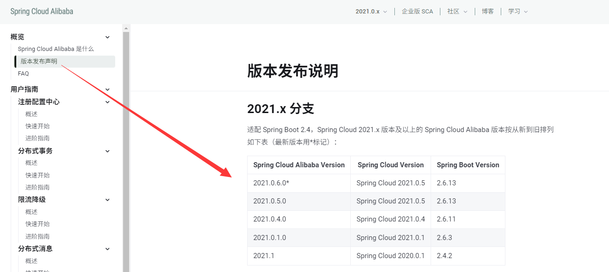
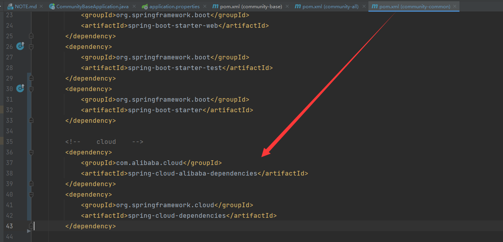
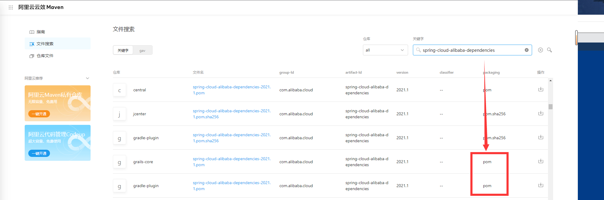
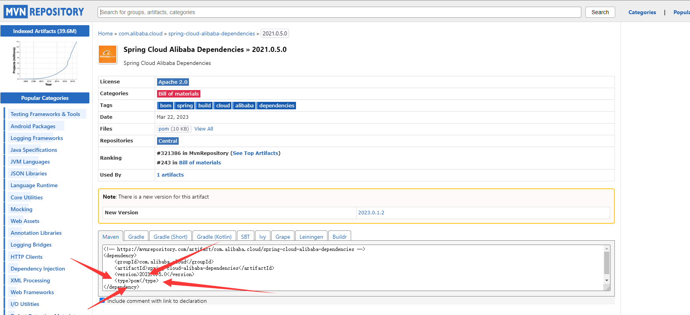

# 随笔

### 2024-07-28

-------
* **拉取新git项目识别不到pom文件**

    右键parent module的pom文件 Add as pom

* **错误: 找不到或无法加载主类**

    重新打包 parent module 

### 2024-07-30 - 31

1、原先计划做个DUBBO的小demo测试不同的RPC协议对调用的效率影响

2、搭建spring cloud 和 spring cloud alibaba环境

3、选择对应的版本

spring cloud doc : `https://sca.aliyun.com/docs/2021/overview/what-is-sca/`

结果一直找不到对应的jar包，即使是配置了阿里仓库镜像

到仓库里找到对应的依赖发现是pom文件，也难怪下载不了`https://developer.aliyun.com/mvn/search`

接着找到maven repository：`https://mvnrepository.com/`

pom文件和jar文件有什么区别呢？
